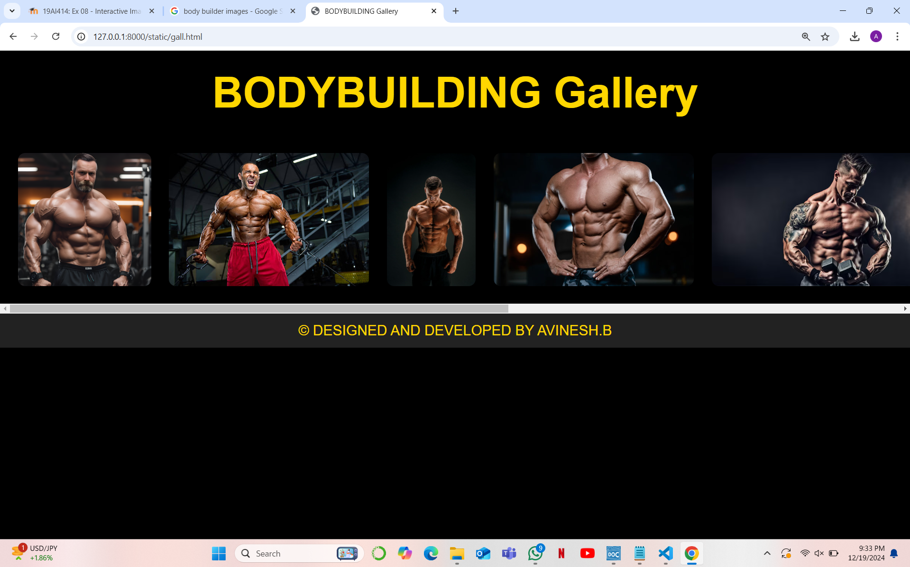

# Ex.08 Design of Interactive Image Gallery
## Date:19/12/2024

## AIM:
To design a web application for an inteactive image gallery with minimum five images.

## DESIGN STEPS:

### Step 1:
Clone the github repository and create Django admin interface.

### Step 2:
Change settings.py file to allow request from all hosts.

### Step 3:
Use CSS for positioning and styling.

### Step 4:
Write JavaScript program for implementing interactivity.

### Step 5:
Validate the HTML and CSS code.

### Step 6:
Publish the website in the given URL.

## PROGRAM :
```
gall.html

<!DOCTYPE html>
<html lang="en">
<head>
    <meta charset="UTF-8">
    <meta name="viewport" content="width=device-width, initial-scale=1.0">
    <title>BODYBUILDING Gallery</title>
    <link rel="stylesheet" href="style.css">
</head>
<body>

    <header>
        BODYBUILDING Gallery
    </header>

    <div class="gallery-container">
        
        
        
        
        
        
        
        
    </div>

    <footer>
        &copy; DESIGNED AND DEVELOPED BY AVINESH.B
    </footer>

    <script src="script.js"></script>
</body>
</html>

style.css

*::before,
*::after {
    box-sizing: border-box;
}

body {
    margin: 0;
    padding: 0;
    background-color: black;
    color: gold;
    font-family: 'Cursive', Arial, sans-serif;
    text-align: center;
}

header {
    font-size: 48px;
    font-weight: bold;
    margin: 20px 0;
}

.gallery-container {
    display: flex;
    overflow-x: auto;
    gap: 20px;
    padding: 20px;
    scroll-behavior: smooth;
}

.gallery-container img {
    height: 150px;
    width: auto;
    border-radius: 8px;
}

footer {
    text-align: center;
    padding: 10px 0;
    color: gold;
    background-color: #222;
}

scrpt.js 

document.addEventListener("DOMContentLoaded", function() {
    const images = document.querySelectorAll('.gallery-container img');

    images.forEach(image => {
        image.addEventListener('mouseenter', function() {
            image.style.transform = "scale(1.2)";  // Zoom in the image on hover
        });

        image.addEventListener('mouseleave', function() {
            image.style.transform = "scale(1)";  // Return to normal size when mouse leaves
        });
    });

    images.forEach(image => {
        image.addEventListener('click', function() {
            alert('You clicked on ' + image.alt);
        });
    });
});


```
## OUTPUT:

## RESULT:
The program for designing an interactive image gallery using HTML, CSS and JavaScript is executed successfully.
